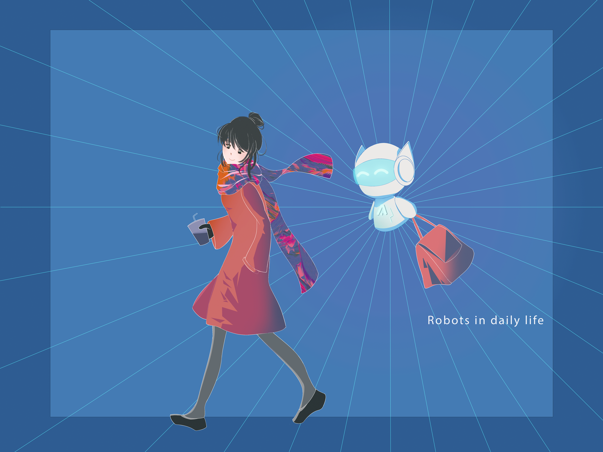
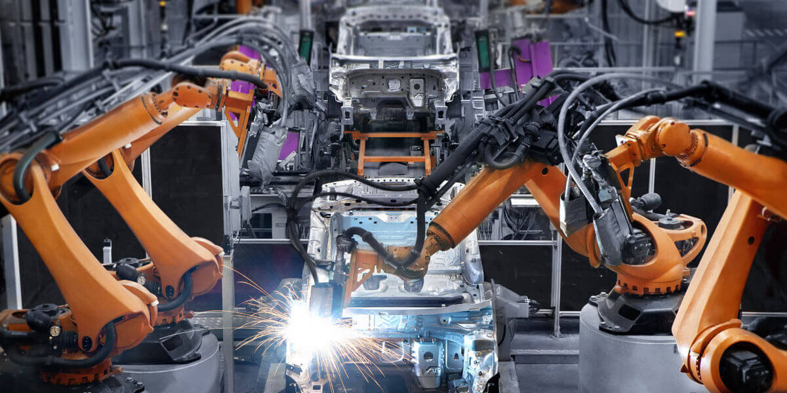

<!--truncate-->

# [Beetlebot series] - Part 01: Robots in daily life. A reality.

Do you believe that robots will become ubiquitous in daily life and attached to you like a silhouette just like the way smartphones are? If you believe that then great! If you are in doubt, let this writing convince you.

You've probably heard of robots in factories. This concept is no longer new to most people in the 21st century. Robots are perfect helping hands for a versatile group of applications, including entertainment, industrial, defense, medicine, etc.

Looking at the past, product manufacturing used to be a tedious task that required a considerable workforce. It was challenging to manage the production speed as during the old days people handled every job manually; however, with the advancement of technology, machines have joined in industrial manufacturing, cumbersome industry. This is one of the most prominent applications of robotics.

Robots are extensively used in assembling automobile parts to develop cars. Robotic arms are also employed in applications that require a task to be done in a repeated fashion, such as nut-bolt fastening, brand-label wrapping, etc.

Robots are extensively used in assembling automobile parts to develop hi-tech cars.

Robots in medicine can perform complex surgeries. Though a surgeon controls a robotic arm to conduct the actual surgery, it improves precision in delicate surgeries.

Using robots in industries provides many advantages, such as increasing the speed of production, avoiding accidents, reducing human error, etc. More than a million industrial robots are now in use, nearly half of them in Japan.

At this point, you may agree that robots have become popular in the industry. What’s about daily life? Unlike using robots in industry, the concepts of robots doing housework, babysitting, or other everyday tasks seem unfamiliar to most people.

As soon as you can realize, robots are already involved in our daily life. You can have these robots to help you with household chores. Some examples of home maintaining robots, delivery robots are Starship, Prime, or Temi.

Some examples of home maintaining robot, delivery robots are Starship, Prime, or Temi.

You would say, "Well, I believe robots will evolve in the future, but for how long will they become popular like smartphones?"

Let's look into objective evidence as an example of how fast technology grows.

The first telephone was introduced in 1876 only for calling, and only the rich could afford them. In 2020, we had small, smart mobile phones with tons of features: calling, web-surfing, picturing, drawing, scanning, etc. The best part is anyone can afford a mobile phone. Only 144 years later, mobile phones have grown to an incredible level that people from 1876 might think that they only appeared in dreams. It takes 58 years for humans to evolve from the first aircraft, only flying 12 seconds in the air, to a spacecraft that can send humans into space. Did our ancestors 100 years ago think that one day they could fly to the moon, where they thought only the gods would reign?

It only takes 58 years for humans to evolve from the first aircraft to a spacecraft.

Every twelve to eighteen months, computers double their capabilities. With the rapid development of technology, you can fully count on a near future where robots are accessible everywhere, a lot where you can also own a robot the same way you would hold a phone.

Technology has been evolving at a rapid rate. Here at AIOZ, we can visibly feel the heat of the technology. It is constantly motivating us, giving us endless energy to join this vibrant community. The more people are participating in the research, the more engaging the environment becomes. I wish I could convey to you this vibrant atmosphere, where all engineers are working hard to research and create new techniques so that you can see that real people are working hard to make dreams come true. Perhaps saying "dream" is no longer suitable because robots have become a "reality", and that reality is coming closer to you than ever!

The end of part 01.
